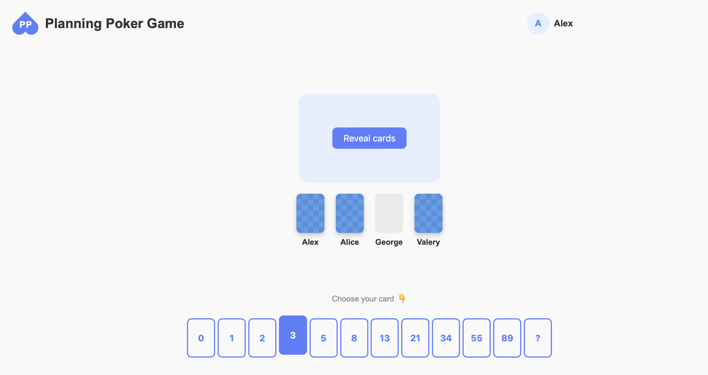

# Planning Poker Free



Planning Poker, also known as Scrum Poker, is a lightweight, collaborative agile estimation tool, designed to make project planning more efficient and engaging. 

This self-hosted, open-source version brings the simplicity and power of Planning Poker directly to your team, allowing you to customize and scale it as needed!

## Quickstart

Run the application locally with Docker:
```shell
make start
```

This command builds the Docker image and runs the application at http://localhost:8000. 

To stop the application and free port 8000, run:
```shell
make stop
```

To run unit tests in Docker container:
```shell
make test-unit
```

To use it together with your team, deploy the service as a Docker image to any hosting. 

## Motivation

Finding convenient solutions for Planning Poker can be challenging, as most useful tools are paid.  

This project aims to fill that gap by providing a free, open-source alternative with a minimal yet essential set of features.  

Originally started as a hackathon project, it has evolved into a fully functional and ready-to-use open-source tool for agile teams.  

## Development

Please start by reviewing the current limitations and development recommendations.

### Existing Limitations

- No JavaScript framework is currently used for the frontend.
- Very simple but inefficient synchronous web-server is used.  
- Lack of robust data type validation on the backend.

### Recommendations

If you want to create more complex product from this project, I recommend you to implement the following improvements before adding new features.

Backend Enhancements:
- Implement data validation using a framework such as **pydantic** or **Marshmallow**.
- Consider switching to an asynchronous, modern and more powerful web-framework like **FastAPI** or at least switching to `ASGI` with **uvicorn**. 
- Transition to a relational DBMS like **PostgreSQL** to ensure scalability and data integrity. Connect to a DBMS using an ORM library like **SQLAlchemy**.

Frontend Improvements:
- Migrate the frontend to a modern Single Page Application (SPA) framework such as **React**, **Vue.js**, or **Svelte** for better maintainability.
- Adopt a CSS framework like **Tailwind CSS** to simplify styling and ensure a consistent, professional design.

### Further development

Product features I consider useful to implement for better user experience:
1. Add the ability to specify a list of cards to be estimated.
2. Improve the UX for the voting process: add animation for the “Reveal” button, include a countdown timer before revealing results, prevent revealing cards until a vote is cast, and arrange the cards aesthetically around the table.
3. Add authorization and user profiles with options to log in and log out.
4. Multiple deck types: Fibonacci, modified Fibonacci, T-Shirt sizes, powers of 2, etc.

## License

This project is licensed under the MIT License. You are free to use, modify, and distribute this software under the terms of the license.
